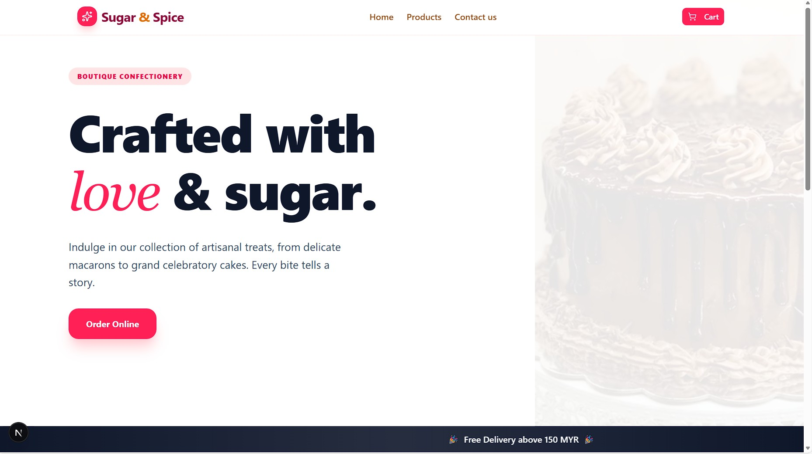

## 🍰 Menu Sugar & Spice

Menu Sugar & Spice é uma plataforma web desenvolvida para representar o cardápio digital de uma doceria.
O objetivo do projeto é permitir que visitantes visualizem todos os produtos disponíveis, adicionem itens ao carrinho e finalizem o pedido de forma prática via WhatsApp, sem a necessidade de um sistema de pagamento integrado.

O projeto também conta com uma área administrativa, permitindo o gerenciamento completo de categorias e produtos.
---

## 🚀 Tecnologias utilizadas

- **React**
- **Next.js**
- **Tailwind CSS**
- **Supabase** (autenticação e banco de dados)
- **Lucide Icons**

---

## ✨ Funcionalidades

- Cadastro e login de usuários
- Cadastro de categoria
- Cadastro de produtos
- Listagem de produtos por categoria
- Área administrativa para gerenciamento

---

## 🖥️ Preview do projeto



> 💡 A imagem acima mostra a interface principal da aplicação.

---

## 📦 Como rodar o projeto localmente

```bash
# Clone o repositório
git clone https://github.com/GabrielaSouz/Menu-Sugar-Spice.git

# Entre na pasta
cd Service-tips

# Instale as dependências
npm install

# Rode o projeto
npm run dev
